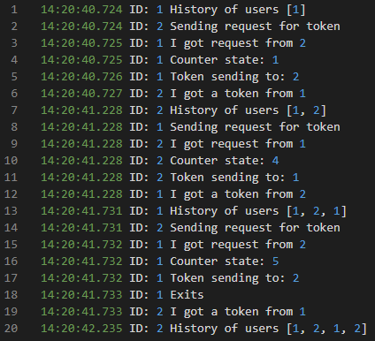

# Distributed monitor - study project
Using an alghoritm Suzuku-Kasami

## Requirements
* pyzmq==23.2.0 <br>
* zmq==0.0.0

## Tutorial

When monitor is initialized it creates a socket on the selected port and starts listening on the others. Ports are defined in utils.py.

The client with id = 1 holds the token first.

There are avaible following methods:

### Methods
```python
send_request() #sends a request for a token
go_into_critical() # when got a token goes into critical section
get_elements() # gets the data that you can manipulate later on
update_elements(data) # update the data
sending_token() # send token to the first requester.
```
### How to run

The following example you can run by executing
```shell
pip install -r requirements.txt
python3 starter.py
```




